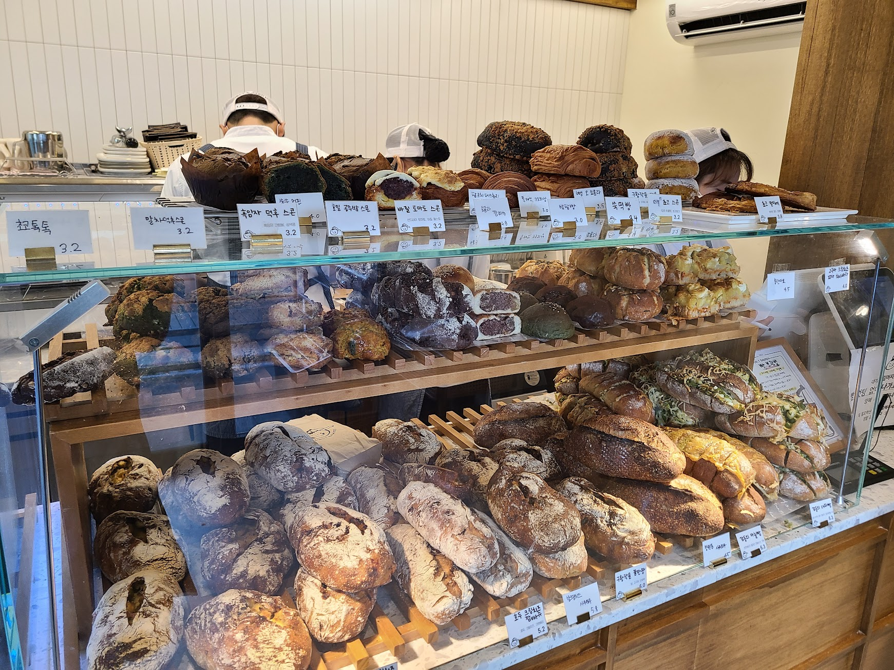
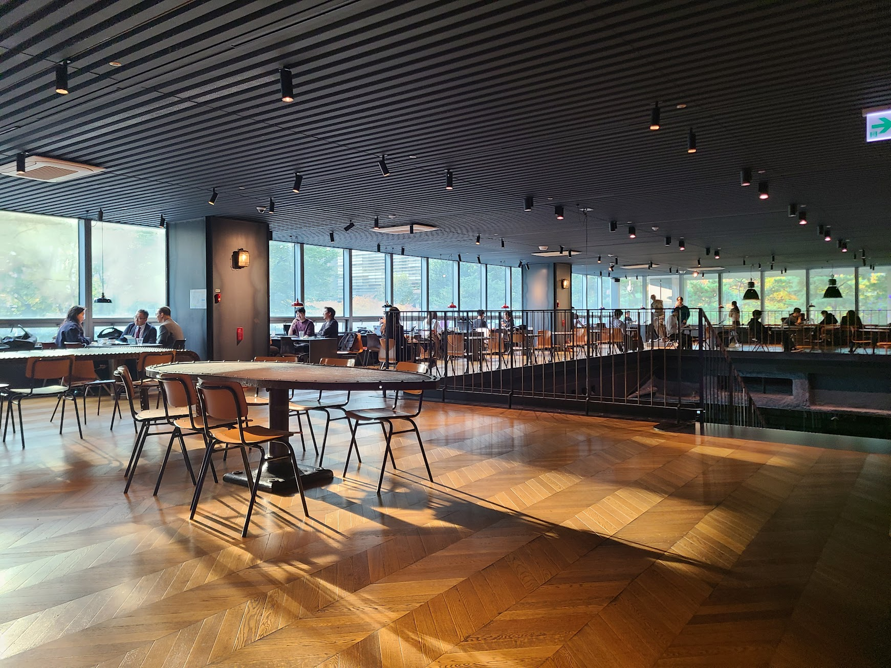

## 문제 1

Q: 다음 이미지에 대한 설명 중 옳지 않은 것은 무엇인가요?

- (1) 빵 진열대에 여러 종류의 빵이 있습니다.
- (2) 모든 빵의 가격이 3.2로 표시되어 있습니다.
- (3) 진열대 위에 있는 빵은 호두가 들어간 것으로 보입니다.
- (4) 흰색 모자를 쓴 직원이 보입니다.

정답: (2) 모든 빵의 가격이 3.2로 표시되어 있지 않습니다.

------------------------

## 문제 2

Q: 다음 이미지에 대한 설명 중 옳지 않은 것은 무엇인가요?

- (1) 넓은 실내 공간에 테이블과 의자가 배치되어 있습니다.
- (2) 창문 밖으로 녹색 나무들이 보입니다.
- (3) 실내 조명은 매우 어두운 상태입니다.
- (4) 여러 사람들이 테이블에 앉아 있습니다.

정답: (3) 실내 조명은 밝은 상태입니다.

------------------------

